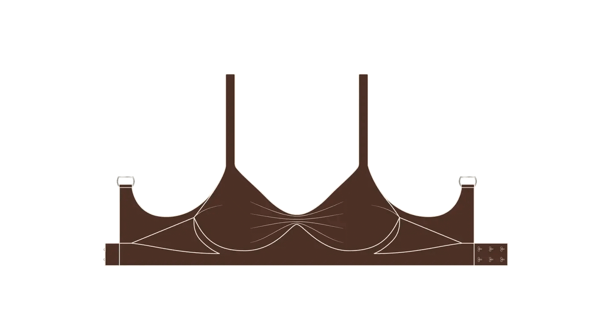

# Never Another Cart Flow revamp
*by Kaos-Kontrollørerne*

# About Project

This project aims to bring a effective cart experience for Never Another customers.

Never Another is a bespoke bra manufacturer, that provides customers with bespoke tailored bras using several measurements, to ensure a perfect fit for any body.

Using several usertests we have found points of improvements of their website and user flow, that we are incorporating into an Android app.

# Release
**Release of PoC, 29/05/2026.**
 
This release features an Proff of Concept App, that includes a a purchase flow, where the user can choose to do their measurements using either the improved manual guide, or the Work in Progress (WIP) 3D scanner. 
 
Theres also the option to see and save measurements to the cloud
 
**MEASUREMENT HISTORY IS WIP AND DOES NOT STORE DATA PRIVATELY** 

# Features:
- Choose measurement method:
    - 3D scanner
    - Manual guide
- 3D scanner (AR):
  - Scan using phonecamera
  - Using Android ARcore to 3D map torso
  - 3D viewer of scan
  - Rotate and tap points for measuring
  - All data processed locally on phone for data privacy
  - Data deletes with closing of 3D scanner
- Revamped Manual Measuring Guide:
  - Improved visual guides
  - Choice between visual or video guide
  - Clear progress bar
- Revamped Product Page
  - Insert measurements manually 
  - "read more" button for long text
- Revamped frontpage
  - Clear call-to-action buttons
  - Direct button to product page
- Measurement history (WIP)
  - Save recent measurement to a cloud database (Supabase)
  - View a history of previously saved measurements
  - **MEASUREMENT HISTORY IS WIP AND DOES NOT STORE DATA PRIVATELY** 

# Kaos-kontrollørene:
- Elliot Theodor Lyhne Christensen
- Mathias Hartung Borup
- Rosalina Hoff Kjærgaard
- Sebastian Herler Lindquist
- Victor Bischoff Mørkeberg
